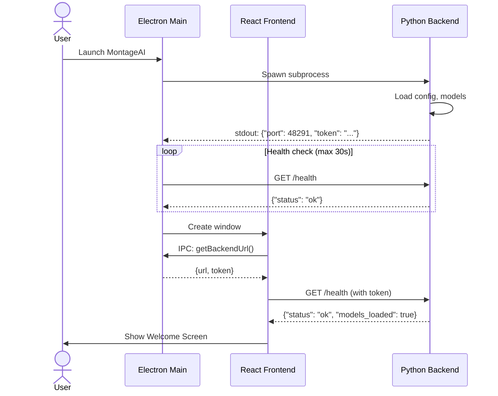
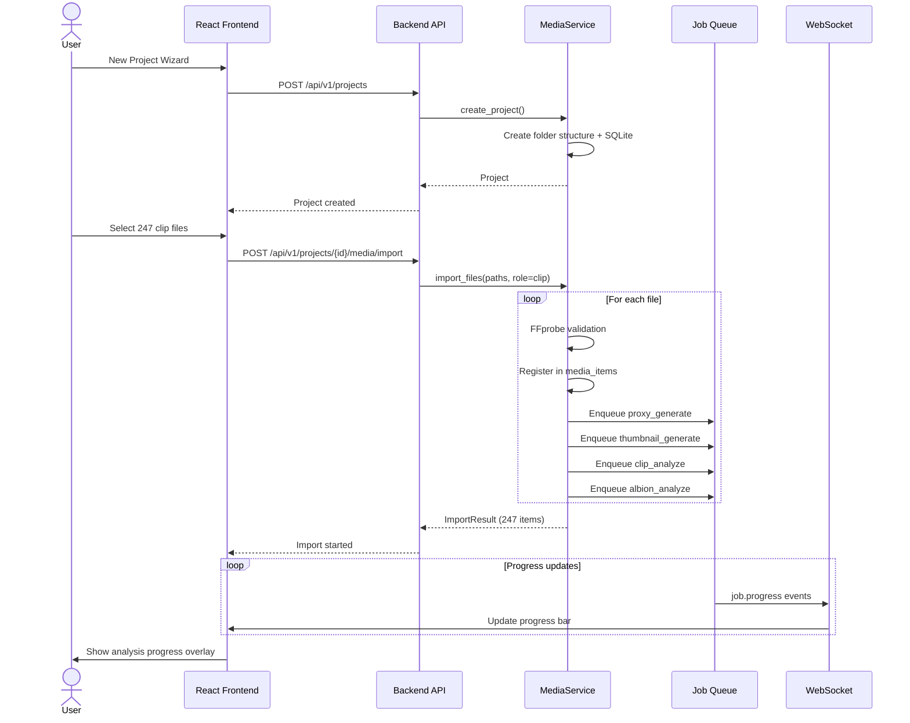
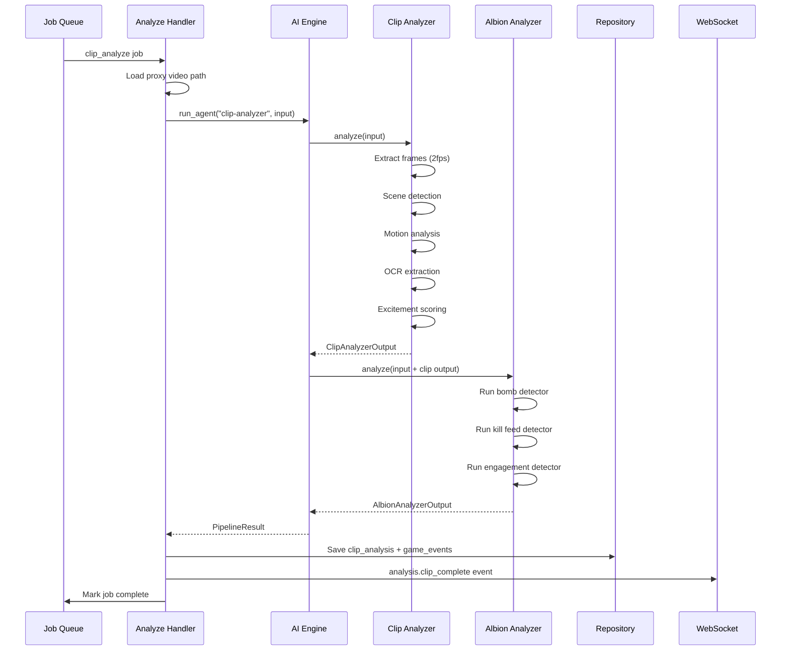
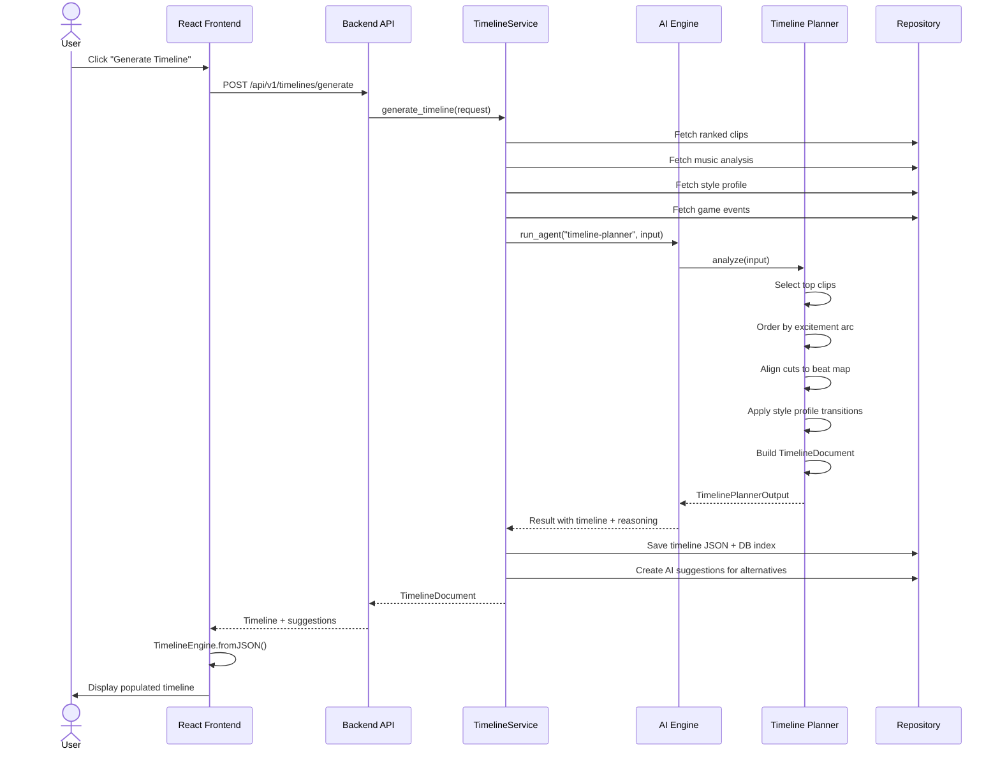
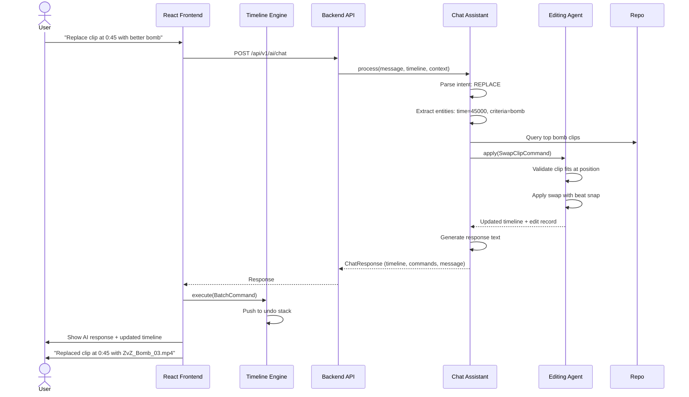
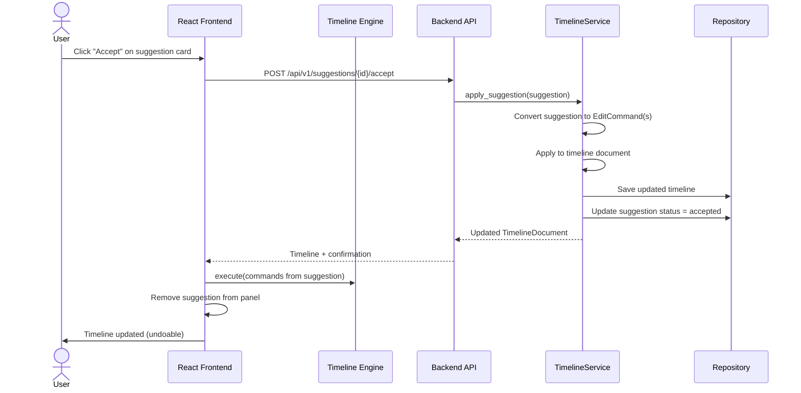
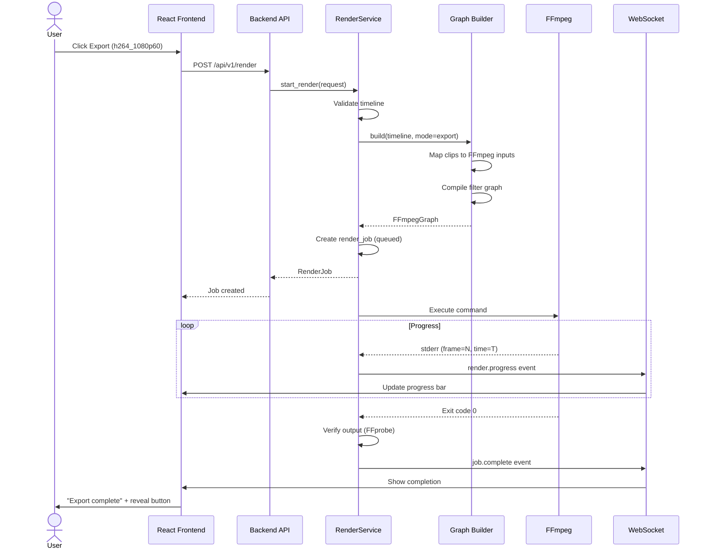
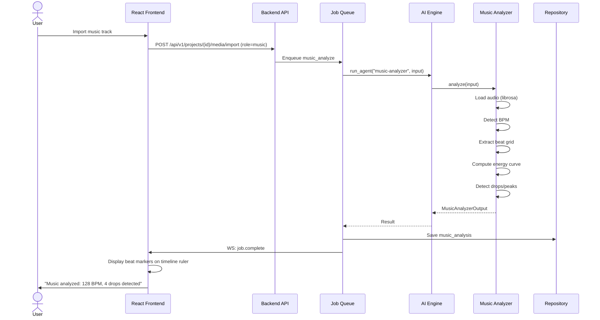
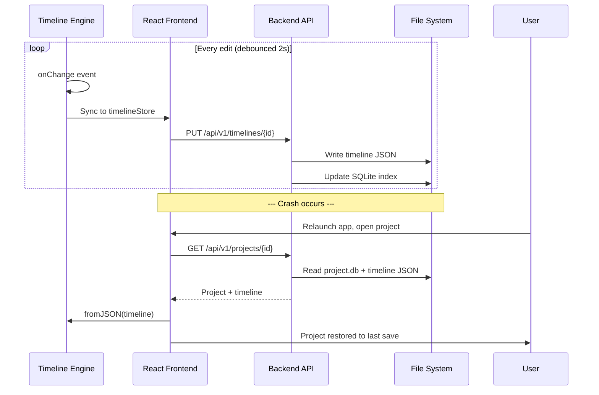
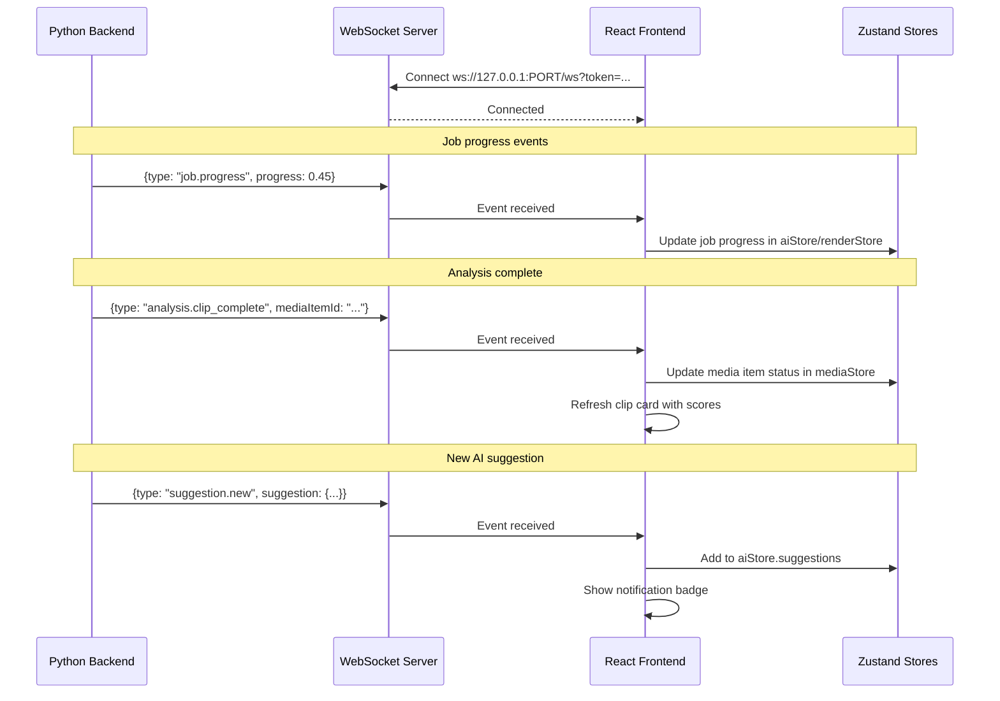

# Sequence Diagrams

**Product:** MontageAI  
**Version:** 1.0  
**Date:** 2026-06-26

---

## 1. Application Startup

---

## 2. Create Project & Import Media

---

## 3. Clip Analysis Pipeline

---

## 4. Generate AI Timeline

---

## 5. Natural Language Timeline Edit

---

## 6. Accept AI Suggestion

---

## 7. Export / Render

---

## 8. Music Analysis

---

## 9. Auto-Save & Crash Recovery

---

## 10. WebSocket Event Flow

